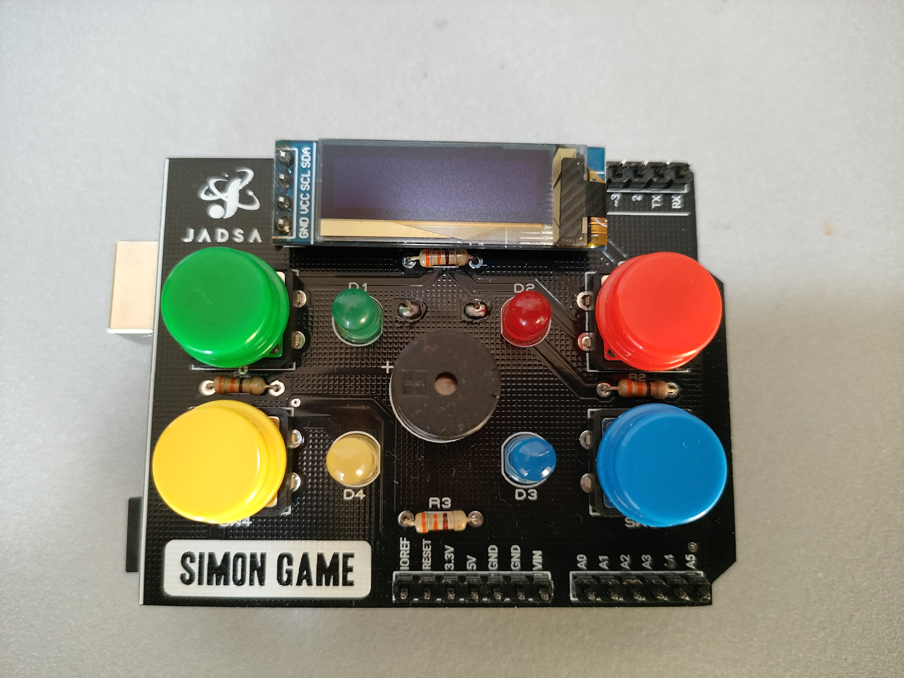

# simon-arduino-game-shield
The classis memory game implemented on Arduino Platform

Here's the link to the pcb and gerber files
https://www.pcbway.com/project/shareproject/Simon_Says_Game_Shield_Arduino_2256ad78.html

For more information and explanation:
https://youtu.be/2GHiqFzK2xI

